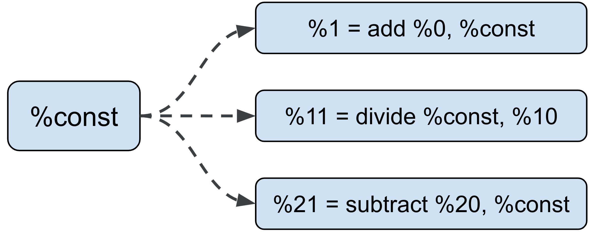
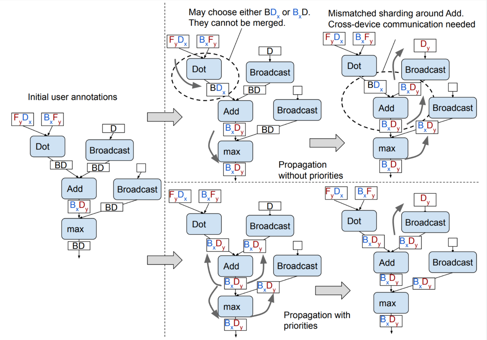

# Dialect-agnostic Sharding

The long term goal is to make Shardy a completely standalone component, able to work with any MLIR dialect. Currently,
we directly depend on StableHLO, but we are making progress towards lifting that through various
abstractions and interfaces to make Shardy more flexible.

## Sharding Rules

A _Sharding rule_ encodes how we can propagate through an operation. Since Shardy now depends on StableHLO, it defines
sharding rules for each op. In addition, Shardy provides the [`ShardingRuleOpInterface`](./sdy_op_interfaces#shardingruleopinterface_shardingruleopinterface)
which can be used by dialect owners in their operations to define their own sharding rules. As long as an operation
implements this interface, Shardy will be able to propagate through it.

```mlir
def ShardingRuleOpInterface : OpInterface<"ShardingRuleOpInterface"> {
  let methods = [
    InterfaceMethod<
      /*desc=*/[{
        Returns the sharding rule of the op.
      }],
      /*retType=*/"mlir::sdy::OpShardingRuleAttr",
      /*methodName=*/"getShardingRule"
    >,
  ];
}
```

In the future, more interfaces and traits will be added to make Shardy more flexible and dialect-agnostic.

## Region-based ops (Data flow ops)

Region-based ops required a different approach where sharding rules, which only describe the correspondence between
operands and results, are not enough. In these cases, we need to describe how the sharding is propagated through the
regions of the op.

Shardy defines a [`ShardableDataFlowOpInterface`](./sdy_op_interfaces#shardabledataflowopinterface_shardabledataflowopinterface)
so that dialect owners can describe the propagation of sharding through the regions of their ops. This interface provides
methods to get and set the sharding information for block arguments, op results, and edge sources.

```mlir
def ShardableDataFlowOpInterface :
    OpInterface<"ShardableDataFlowOpInterface"> {
  (get|set)BlockArgumentEdgeOwnerShardings;
  (get|set)OpResultEdgeOwnerShardings;
  getBlockArgumentEdgeOwners;
  getOpResultEdgeOwners;
  getEdgeSources;
  // ...
}

%0:2 = stablehlo.while(%iterArg = %arg0, %iterArg_2 = %c) 
  : tensor<32x96xf32>, tensor<i32>
  cond {
  // ...
  stablehlo.return %3 : tensor<i1>
} do {
  // ...
  stablehlo.return %4, %3 : tensor<32x96xf32>, tensor<i32>
}
```

See also [Data flow ops](./propagation#data-flow-ops) for a high-level overview of how we handle data flow ops.

## Constant splitting

Most tensor programs in MLIR have one instance of a constant that is reused by whatever op that needs that value. This
makes sense when the constant needed is the same. However, for optimal sharding of a program, we would like to allow
each use of a constant to have its own sharding, and not be affected by how other ops use that constant.

For example in the figure below, if the `add` is sharded, it should not affect how the `divide` and `subtract` (in
different parts of the computation) are sharded.



We call this a _false dependency_: because constants are cheap, there isn't a real dependency between ops that use the
same constant. As such, users can decide on the sharding of their constant (and constant-like) ops. Each use of that
constant can then have a different sharding that can propagate in isolation to its own copy of the constant sub-computation.

To achieve this, Shardy users need to define:
- A `your_dialect.constant` -> `sdy.constant` pass;
- A `sdy::ConstantLike` trait, such as [iota ops](https://openxla.org/stablehlo/spec#iota);
- A `mlir::Elementwise` trait for element-wise ops like `add` and `multiply`;
- A `sdy::ConstantFoldable` for ops like slice/broadcast. These ops can technically be calculated at compile time, if all
  their operands/results are constants.

## Op priorities

In GSPMD, element-wise ops are propagated first, followed by ops like `matmul`. In Shardy, we want to allow users to
set their own op priorities since we don't know about their dialects _a priori_. As such, we will ask them to pass a
list of ops in the order they want Shardy to propagate them in.

The figure below shows how the priorities are used in GSPMD to propagate ops in the right order.



See the [GSPMD paper](https://arxiv.org/abs/2105.04663) for a discussion on why op priorities are important.

## Being dialect-agnostic

As long as you implement the previous interfaces, traits, and pass, Shardy will be able to work for your dialect. We
are working on making Shardy more flexible and dialect-agnostic, so stay tuned for more updates.
