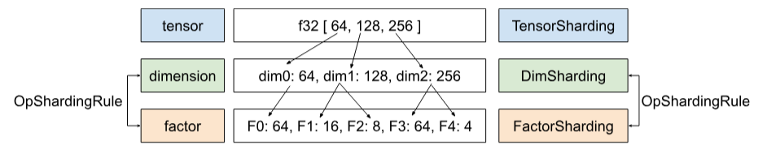
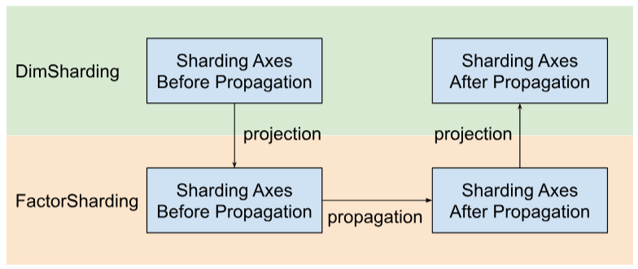

# Propagation

## Overview

Sharding propagation uses the user-specified shardings to infer the unspecified
shardings of tensors (or specific dimension of tensors). It traverses the data
flow (use-def chains) of the computation graph in both directions until a fixed
point is reached, i.e., the sharding can no longer change without undoing
previous sharding decisions.

Propagation can be decomposed into steps. Each step involves looking at a
specific operation and propagating between tensors (operands and results), based
on the characteristics of that operation. Taking a matmul as an example, we
would propagate between the non-contracting dimension of either lhs or rhs to
the corresponding dimension of the result, or between the contracting dimension
of the lhs and rhs.

The characteristics of an operation determine the connection between
corresponding dimensions in its inputs and outputs, and can be abstracted as a
per op [sharding rule](#operation-sharding-rule).

Without conflict resolution, a propagation step would simply propagate as much
as it can while ignoring the conflicting axes; we refer to this as the (longest)
compatible major sharding axes.

## Detailed Design

### Conflict resolution hierarchy

We compose multiple conflict resolution strategies in a hierarchy:

1.  **User defined priorities**. In
    [Sharding Representation](sharding_representation.md), we described how
    priorities can be attached to dimension shardings to allow for incremental
    partitioning of the program, e.g., doing batch parallelism -> megatron ->
    ZeRO sharding. This is achieved by applying propagation in iterations - at
    iteration `i` we propagate all dimension shardings that have priority `<=i`
    and ignore all others. We also make sure that propagation won't override
    user defined shardings with lower priority (`>i`), even if they are ignored
    during previous iterations.
2.  **Operation based priorities**. We propagate shardings, based on the
    operation type. The "pass-through" operations (e.g., element-wise operations
    and reshape) have the highest priority, while operations with shape
    transformation (e.g., dot and reduce) have lower priority.
3.  **Aggressive propagation.** Propagate shardings with an aggressive strategy.
    The basic strategy only propagates shardings without conflicts, while the
    aggressive strategy resolves conflicts. Higher aggressiveness can reduce the
    memory footprint at the cost of potential communication.
4.  **Basic Propagation.** It is the lowest strategy of propagation in the
    hierarchy, that doesn't do any conflict resolution, and instead propagates
    axes that are compatible between all operands and results.


This hierarchy can be interpreted as nested for loops. For example, for each
user priority, a full op-priority propagation is applied.

### Operation sharding rule

The sharding rule introduces an abstraction of every operation that provides the
actual propagation algorithm with the information it needs to propagate
shardings from operands to results or across operands, etc., without having to
reason about specific operation types and their attributes. This is essentially
factoring out the op-specific logic and providing a shared representation (data
structure) for all ops for the purpose of propagation only. In its simplest
form, it just provides this function:

```c
GetOpShardingRule(Operation *) -> OpShardingRuleAttr
```

The rule allows us to write the propagation algorithm only once in a generic way
that is based on this data structure (OpShardingRule), instead of replicating
similar pieces of code across many ops, vastly reducing the possibility for bugs
or inconsistent behavior across ops.

Let's go back to the matmul example.

An encoding that encapsulates the information needed during propagation, i.e.,
the relations between dimensions, can be written in the form of einsum notation:

```
(i, k), (k, j) -> (i, j)
```

In this encoding, every dimension is mapped to a single factor.

**How propagation uses this mapping:** If a dimension of an operand/result is
sharded along an axis, propagation will lookup the factor of that dimension in
this mapping, and shard other operands/results along their respective dimension
with the same factor – and (subject to the earlier discussion about replication)
potentially also replicate other operands/results that don't have that factor
along that axis.

### Compound factors: extending the rule for reshapes

In many ops, e.g., matmul, we only need to map each dimension to a single
factor. However, it is not enough for reshapes.

The following reshape merges two dimensions into one:

```
%out = mhlo.reshape(%in) : (tensor<2x4x32xf32>) -> tensor<8x32xf32>
```

Here both dimensions 0 and 1 of the input correspond to dimension 0 of the
output. Say we start by giving factors to the input:

```
(i,j,k) : i=2, j=4, k=32
```

You can see that if we want to use the same factors for the output, we would
need a single dimension to reference multiple factors:

```
(i,j,k) -> ((ij), k) : i=2, j=4, k=32
```

The same can be done if the reshape were to split a dimension:

```
%out = mhlo.reshape(%in) : (tensor<8x32xf32>) -> tensor<2x4x32xf32> ((ij), k) -> (i,j,k) : i=2, j=4, k=32
```

The dimension of size 8 here is essentially composed of the factors 2 and 4,
which is why we are calling the factors (i,j,k) factors.

These factors can also work with cases where there is no full dimension that
corresponds to one of the factors:

```
%out = mhlo.reshape(%in) : (tensor<8x4xf32>) -> tensor<2x16xf32> ((ij), k) -> (i,(jk)) : i=2, j=4, k=4
```

This example also emphasizes why we need to store the factor sizes - since we
can't easily deduce them from the corresponding dimensions.

### Core Propagation Algorithm

#### Propagate shardings along factors

In Shardy, we have the hierarchy of tensors, dimensions, and factors. They
represent data at different levels. A factor is a sub-dimension. It is an
internal hierarchy used in sharding propagation. Each dimension may correspond
to one or more factors. The mapping between dimension and factor is defined by
OpShardingRule.



**Shardy propagates sharding axes along factors instead of dimensions**. To do
that, we have three steps as shown in the figure below

1.  Project DimSharding to FactorSharding
2.  Propagate sharding axes in the space of FactorSharding
3.  Project the updated FactorSharding to get the updated DimSharding



#### Visualization of Sharding Propagation Along Factors

We will use the following table to visualize the sharding propagation problem
and algorithm.

    | F0  | F1  | F2  | Explicitly replicated axes
:-- | :-- | :-- | :-- | :-------------------------
T0  |     |     |     |
T1  |     |     |     |
T2  |     |     |     |

*   Each column represents a factor. F0 means the factor with index 0. We
    propagate shardings along factors (columns).
*   Each row represents a tensor. T0 refers to the tensor with index 0. Tensors
    are all operands and results involved for a specific operation. The axes in
    a row cannot overlap. An axis (or sub-axis) cannot be used to partition one
    tensor many times. If an axis is explicitly replicated, we cannot use it to
    partition the tensor.

Thus, each cell represents a factor sharding. A factor can be missing in partial
tensors. The table for `C = dot(A, B)` is below. The cells containing an `N`
imply that the factor is not in the tensor. For example, F2 is in T1 and T2, but
not in T0.

`C = dot(A, B)` | F0 Batching dim | F1 Non-contracting dim | F2 Non-contracting dim | F3 Contracting dim | Explicitly replicated axes
:-------------- | :-------------- | :--------------------- | :--------------------- | :----------------- | :-------------------------
T0 = A          |                 |                        | N                      |                    |
T1 = B          |                 | N                      |                        |                    |
T2 = C          |                 |                        |                        | N                  |

#### Collect and propagate sharding axes

We use a simple example shown below to visualize the propagation.

    | F0       | F1       | F2  | Explicitly replicated axes
:-- | :------- | :------- | :-- | :-------------------------
T0  | "a"      |          | "f" |
T1  | "a", "b" | "c", "d" | "g" |
T2  |          | "c", "e" |     |

**Step 1.** Find axes to propagate along each factor (a.k.a. the (longest)
compatible major sharding axes). For this example, we propagate `["a", "b"]`
along F0, propagate `["c"]` along F1, and propagate nothing along F2.

**Step 2.** Expand the factor shardings to obtain the following result.

    | F0           | F1       | F2  | Explicitly replicated axes
:-- | :----------- | :------- | :-- | :-------------------------
T0  | "a", **"b"** | **"c"**  | "f" |
T1  | "a", "b"     | "c", "d" | "g" |
T2  | **"a", "b"** | "c", "e" |     |
