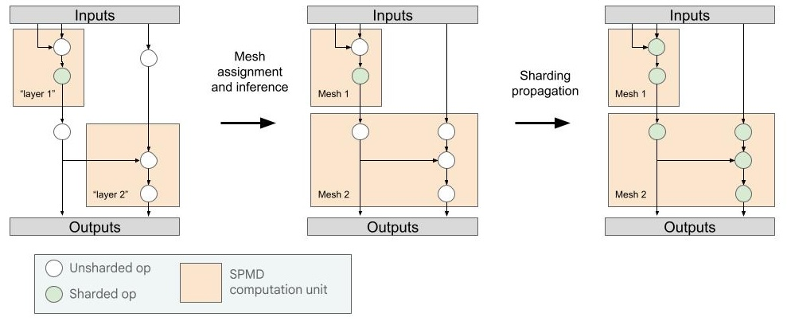

# MPMD RFC

## Motivation – why MPMD instead of SPMD?

As models get larger and resources become more constrained, the flexibility and
performance that MPMD provides is increasingly beneficial.

With MPMD (“multiple-program multiple-data”), users can express more complex
programs than SPMD (“single-program multiple-data”).

We focus on two main motivating cases:

1.  Pipeline parallelism, and
2.  Heterogeneous compute clusters.

### Quick recap on pipeline parallelism

Recall that pipeline parallelism is one of many
[parallelism strategies](https://jax-ml.github.io/scaling-book/training/#tensor-parallelism)
that helps fit large models over many devices. Pipeline parallelism basically
means chopping a model into smaller components, e.g. as follows:


Pipeline parallelism is easily composed with other tensor parallelism
strategies: e.g. within each pipeline stage, we can have data parallelism,
megatron sharding, etc.

The key benefit of pipeline parallelism over tensor parallelism is that the
amount of data communicated scales not with parameters, but with the activation
sizes. And this is particularly important for some low-latency uses and also for
parallelism across slow networks (e.g. multi-host GPU setups, or across DCN for
TPUs).

### MPMD and pipeline parallelism

The relevance of MPMD is that the way we’ve chopped up our program above is an
MPMD program: notice that the programs on mesh 1 and 4 differ from those on mesh
2 and 3.

Some pipeline schedules are doable in SPMD (e.g. GPIPE), but implementation is
often tricky and invasive. Furthermore, many pipeline schedules are MPMD
parallel programs by nature: different programs may be executed on different
stages at a given point, e.g. 1F1B or Near Zero Bubble.

This is where Shardy:MPMD comes in: it **aims to make pipelining a program**
**easy and intuitive**.

### Heterogeneous compute clusters

Beyond pipeline parallelism, MPMD also allows us to execute a program over
different device types. Note that this isn’t possible in the SPMD paradigm, as
the compiled programs are necessarily different over different device types.

The growing demand for hardware means that heterogeneous compute clusters are
sometimes the most economical way of achieving the necessary compute.
Furthermore, there are potential efficiency gains from mixing hardware with
different performance profiles.

### When to use Shardy:MPMD

Because Shardy:MPMD (and MPMD in general) involves longer compile times and
additional MPMD-specific complexity/knowledge, it is often good to start with an
SPMD program, and then migrate to MPMD when it is needed.

As mentioned above, it is particularly useful when pipeline parallelism or
heterogeneous compute is needed. These situations often arise for:

*   Large training workloads.
*   Running on cheaper hardware or hardware with slow network connection.
*   Utilizing the maximum amount of hardware, regardless of device type.

## Overview

### What is Shardy:MPMD?

Shardy:MPMD is an MLIR library designed for intuitive and performant MPMD
partitioning whilst retaining single-device programming semantics, and is
composable with SPMD partitioning. To achieve this, the MPMD partitioning is
done via annotations and compiler passes (like Shardy) and requires minimal
manual intervention.

The **Shardy:MPMD program is** **just a bunch of SPMD programs** with the
orchestration and data transfer between the SPMD programs statically specified.
This allows us to keep the SPMD-program semantics, and hence allows moving from
SPMD to MPMD with minimal changes. Because we do this in MLIR, it is independent
of any runtime. E.g. we have developed this using IFRT IR + Pathways, but it can
be lowered to another IR.

To go from an SPMD program to an MPMD program with Shardy:MPMD, the user only
needs to annotate parts of their program with names and provide a name-to-mesh
assignment map. Shardy:MPMD will then handle the MPMD and SPMD sharding
propagation, and any scheduling (e.g. pipeline schedules) as provided by the
user.



### MPMD + JAX

While Shardy:MPMD doesn’t rely on any specific ML framework, we have developed
it with an experimental JAX API.

With this API, moving from SPMD to MPMD is simple: add some `named_computation`
ops, and use `mpmd.jit` instead of `jax.jit`.

```python
def simple_train_step(x):
  c1 = mpmd.named_computation(lambda y: y + y, name="c1")(x)
  c2 = mpmd.named_computation(lambda y: y + y, name="c2")(c1)
  return c2

mpmd_config = mpmd.make_config(
  topology = {
    "m1": jax.sharding.Mesh(mesh1_devices, axes),
    "m2": jax.sharding.Mesh(mesh2_devices, axes),
  },
  assignment = { "c1": "m1", "c2": "m2" }
)

samples = jnp.ones((512,512))
lowered = mpmd.jit(simple_train_step, mpmd_config).lower(samples)
c = lowered.compile()

placed_samples = jax.device_put(
samples,
lowered.function_named_shardings.inputs[0]
)
res = c(placed_samples)
```

To execute the MPMD program, we currently require
[Pathways on Cloud](https://cloud.google.com/ai-hypercomputer/docs/workloads/pathways-on-cloud/pathways-intro).
We lower to
[IFRT IR](https://github.com/openxla/xla/tree/main/xla/python/ifrt/ir)
(an open source runtime IR) which
Pathways executes, so we can replace it with any runtime that handles IFRT IR or
lower from IFRT IR to another IR.

See our [read-only colab](2025-06-18-mpmd-rfc-read-only-colab.ipynb) for an
example of pipelining a Transformer.

### Components

The MPMD program is represented as a sequence of SPMD computation units
(“fragments”) and data transfers (“transfers”) between them, with fragments
assigned to groups of devices (SPMD “meshes”).

To decouple changes in MPMD partitioning from changes to the model, we allow our
input program to be given labels, instead of assigning the meshes explicitly.

Furthermore, for ease-of-use, we allow partial labelling/assignment. I.e. not
every computation/array needs to be labelled.

To obtain a performant MPMD program, we have a series of transformations as
follows:

*   [**Mesh assignment**](#mesh-assignment): Assigns computations with labels to
    their meshes, as provided by the user, and creates transfers between these
    computations.
*   [**Mesh inference**](#mesh-inference): Takes a partially assigned MPMD
    program (i.e. not every op has been assigned a mesh), and completes the
    assignment. I.e. assigns all meshless ops to a fragment on some mesh, while
    minimizing transfers.
*   [**Fragment scheduling**](#fragment-scheduling): Applies a user-provided
    schedule to the MPMD program. E.g. a pipeline schedule like 1F1B, or Near
    Zero Bubble.
*   [**Fragment merging**](#fragment-merging): Merges fragments together
    according to user input. This allows for finer-grained labelling of programs
    which allows for more flexibility in assignment, e.g. labelling a
    transformer by its layers instead of pipeline stages. It also allows for
    further optimizations, e.g. merging the forward and backward of the last
    pipeline stage in 1F1B.
*   [**SPMD Sharding propagation**](#spmd-sharding-propagation): Applies
    sharding propagation to the entire MPMD program using Shardy.
*   [**Export**](#export): A mix of passes which prepares the MLIR module for
    compilation (XLA or otherwise). E.g. dedupes similar programs together, etc.

## Examples

To give a flavour of what these components do, we have two examples below:

1.  A simple example demonstrating mesh assignment and inference.
2.  An example demonstrating a 1F1B pipeline schedule

### Simple example of mesh inference

Here we just have a simple program with two “addition layers” , and some
operations outside the named_computations (“nameless ops”).

We map `layer1` to `m1` and `layer2` to `m2`, and note that the transfers are
inserted between the meshes.

Then mesh inference will push the multiply and divide into the corresponding
fragments.

#### Initial

```mlir
#topology = #sdy.topology<<"m1": <"x"=2>>, <"m2": <"x"=2>>>
!t = tensor<4xf32>

func.func @main(%arg0: !t, %arg1: !t) -> (!t, !t)
  attributes {topology=#topology} {
  %1 = mpmd.named_computation<"layer1"> (%arg0, %arg1) (%arg2: !t, %arg3: !t) {
    %10 = stablehlo.add %arg2, %arg2 : !t
    mpmd.return %10 : !t
  } : (!t, !t) -> !t

  %c = stablehlo.constant dense<0.000000e+00> : !t
  %2 = mpmd.named_computation<"layer2"> (%1, %c) (%arg2: !t, %arg3: !t) {
    %10 = stablehlo.add %arg2, %arg2 : !t
    mpmd.return %10 : !t
  } : (!t, !t) -> !t

  %3 = stablehlo.multiply %1, %1 : !t
  %4 = stablehlo.divide %2, %2 : !t

  func.return %3, %4  : !t, !t
}
```

#### Mesh assignment

```mlir
!m1_t = !mpmd.mesh_tensor<"m1", !t>
!m2_t = !mpmd.mesh_tensor<"m2", !t>

// Map layer1 -> m1, layer2 -> m2
module {
  sdy.mesh @mesh = <["x"=2]>
  func.func @main(%arg0: !t, %arg1: !t) -> (!t, !t) attributes {topology=#topology} {
    %0 = mpmd.assign %arg0 : (!t) -> !m1_t
    %1 = mpmd.fragment<mesh="m1", origin=["layer1"], stage=1> (%0) (%arg2: !t) {
      %8 = stablehlo.add %arg2, %arg2 : !t
      mpmd.return %8 : !t
    } : (!m1_t) -> !m1_t
    %2 = mpmd.unassign %1 : (!m1_t) -> !t

    // We introduce a cross-mesh transfer.
    %3 = mpmd.transfer %1 : (!m1_t) -> !m2_t
    %4 = mpmd.fragment<mesh="m2", origin=["layer2"], stage=2> (%3) (%arg2: !t) {
      %8 = stablehlo.add %arg2, %arg2 : !t
      mpmd.return %8 : !t
    } : (!m2_t) -> !m2_t
    %5 = mpmd.unassign %4 : (!m2_t) -> !t
    %6 = stablehlo.multiply %2, %2 : !t
    %7 = stablehlo.divide %5, %5 : !t
    return %6, %7 : !t, !t
  }
}

```

#### Mesh inference

```mlir
// All stablehlo ops are now in some fragment.

module {
  sdy.mesh @mesh = <["x"=2]>
  func.func @main(%arg0: !m1_t, %arg1: !m1_t) -> (!m1_t, !m2_t) attributes {topology=#topology} {
    %0:2 = mpmd.fragment<mesh="m1", origin=["layer1"], stage=1> (%arg0) (%arg2: tensor<4xf32>) {
      %3 = stablehlo.add %arg2, %arg2 : tensor<4xf32>
      %4 = stablehlo.multiply %3, %3 : tensor<4xf32>
      mpmd.return %3, %4 : tensor<4xf32>, tensor<4xf32>
    } : (!m1_t) -> (!m1_t, !m1_t)
    %1 = mpmd.transfer %0#0 : (!m1_t) -> !m2_t
    %2 = mpmd.fragment<mesh="m2", origin=["layer2"], stage=2> (%1) (%arg2: tensor<4xf32>) {
      %3 = stablehlo.add %arg2, %arg2 : tensor<4xf32>
      %4 = stablehlo.divide %3, %3 : tensor<4xf32>
      mpmd.return %4 : tensor<4xf32>
    } : (!m2_t) -> !m2_t
    return %0#1, %2 : !m1_t, !m2_t
  }
}
```

### Scheduling + merging + export for a 2 microbatch, 2 stage pipeline

Here we just have a slightly more complicated program with:

*   Two forward layers (“layer1”, “layer2”) and two backward layers
    (“layer1”(1), “layer2”(1)).
    *   Note that the number in parenthesis denotes the derivative count. E.g.
        “layer2”(n) would be the n-th derivative of “layer2”.
*   Two microbatches (call_counter 0 and 1 – we’ll refer to these as “mb”).
*   The input is batch sharded.

We then apply as follows:

1.  **1F1B pipeline scheduling**: Note that the layer1 at mb=1 now comes before
    layer1(1) at mb=0.
2.  **Merging**: layer2 and layer2(1) are merged together in each mb.
3.  **Sharding propagation**: the entire program is now batch-sharded.
4.  **Export**: Functions across the microbatches are now deduped.
5.  **Lower to IFRT IR**: The program is represented in IFRT IR.

Where the pipeline scheduling and merging are user-controlled. E.g. the user
could pass another pipeline schedule other than 1F1B (DualPipe or GPIPE etc.).
See [Detailed Design](#detailed-design) below for more details.

#### Initial

```mlir
#topology = #sdy.topology<<"m1": <"x"=2>>, <"m2": <"x"=2>>>
#batch_shard = #sdy.sharding<@mesh, [{"x"}]>

!t = tensor<4xf32>
!m1_t = !mpmd.mesh_tensor<"m1", !t>
!m2_t = !mpmd.mesh_tensor<"m2", !t>
!m1_t_batch = !mpmd.mesh_tensor<"m1", !t, sharding=<@mesh, [{"x"}]>>
!m2_t_batch = !mpmd.mesh_tensor<"m2", !t, sharding=<@mesh, [{"x"}]>>

module attributes {mpmd.fragments.global_view} {
  sdy.mesh @mesh = <["x"=2]>
  func.func @main(%arg0: !m1_t {sdy.sharding=#batch_shard}) -> (!m1_t, !m1_t) attributes {topology=#topology} {
    %0 = mpmd.fragment<mesh="m1", origin=["layer1"], stage=1> (%arg0) {call_counter = 0 : ui32} (%arg2: !t) {
      %30 = stablehlo.add %arg2, %arg2 : !t
      mpmd.return %30 : !t
    } : (!m1_t) -> !m1_t

    %1 = mpmd.transfer %0 : (!m1_t) -> !m2_t

    %2 = mpmd.fragment<mesh="m2", origin=["layer2"], stage=2> (%1) {call_counter = 0 : ui32} (%arg2: !t) {
      %30 = stablehlo.add %arg2, %arg2 : !t
      mpmd.return %30 : !t
    } : (!m2_t) -> !m2_t


    %3 = mpmd.fragment<mesh="m2", origin=["layer2"(1)], stage=2> (%2) {call_counter = 0 : ui32} (%arg2: !t) {
      %30 = stablehlo.add %arg2, %arg2 : !t
      mpmd.return %30 : !t
    } : (!m2_t) -> !m2_t

    %4 = mpmd.transfer %3 : (!m2_t) -> !m1_t

    %5 = mpmd.fragment<mesh="m1", origin=["layer1"(1)], stage=1> (%4) {call_counter = 0 : ui32} (%arg2: !t) {
      %30 = stablehlo.add %arg2, %arg2 : !t
      mpmd.return %30 : !t
    } : (!m1_t) -> !m1_t


    %10 = mpmd.fragment<mesh="m1", origin=["layer1"], stage=1> (%arg0) {call_counter = 1 : ui32} (%arg2: !t) {
      %30 = stablehlo.add %arg2, %arg2 : !t
      mpmd.return %30 : !t
    } : (!m1_t) -> !m1_t

    %11 = mpmd.transfer %10 : (!m1_t) -> !m2_t

    %12 = mpmd.fragment<mesh="m2", origin=["layer2"], stage=2> (%11) {call_counter = 1 : ui32} (%arg2: !t) {
      %30 = stablehlo.add %arg2, %arg2 : !t
      mpmd.return %30 : !t
    } : (!m2_t) -> !m2_t


    %13 = mpmd.fragment<mesh="m2", origin=["layer2"(1)], stage=2> (%12) {call_counter = 1 : ui32} (%arg2: !t) {
      %30 = stablehlo.add %arg2, %arg2 : !t
      mpmd.return %30 : !t
    } : (!m2_t) -> !m2_t

    %14 = mpmd.transfer %13 : (!m2_t) -> !m1_t

    %15 = mpmd.fragment<mesh="m1", origin=["layer1"(1)], stage=1> (%14) {call_counter = 1 : ui32} (%arg2: !t) {
      %30 = stablehlo.add %arg2, %arg2 : !t
      mpmd.return %30 : !t
    } : (!m1_t) -> !m1_t

    return %5, %15 : !m1_t, !m1_t
  }
}
```

<details>
<summary>Intermediate IR</summary>

#### After scheduling

```mlir
func.func @main(%arg0: !m1_t {sdy.sharding = #batch_shard}) -> (!m1_t, !m1_t) attributes {topology = #topology} {

  %0 = mpmd.fragment<mesh="m1", origin=["layer1"], stage=1> (%arg0) {call_counter = 0 : ui32} (%arg1: !t) {
    %12 = stablehlo.add %arg1, %arg1 : !t
    mpmd.return %12 : !t
  } : (!m1_t) -> !m1_t
  %1 = mpmd.transfer %0 : (!m1_t) -> !m2_t

  %2 = mpmd.fragment<mesh="m2", origin=["layer2"], stage=2> (%1) {call_counter = 0 : ui32} (%arg1: !t) {
    %12 = stablehlo.add %arg1, %arg1 : !t
    mpmd.return %12 : !t
  } : (!m2_t) -> !m2_t
  %3 = mpmd.fragment<mesh="m2", origin=["layer2"(1)], stage=2> (%2) {call_counter = 0 : ui32} (%arg1: !t) {
    %12 = stablehlo.add %arg1, %arg1 : !t
    mpmd.return %12 : !t
  } : (!m2_t) -> !m2_t
  %4 = mpmd.transfer %3 : (!m2_t) -> !m1_t

  // "layer1" at call_counter `1` is now before "layer1"(1) at call_counter `0`
  %5 = mpmd.fragment<mesh="m1", origin=["layer1"], stage=1> (%arg0) {call_counter = 1 : ui32} (%arg1: !t) {
    %12 = stablehlo.add %arg1, %arg1 : !t
    mpmd.return %12 : !t
  } : (!m1_t) -> !m1_t
  %6 = mpmd.transfer %5 : (!m1_t) -> !m2_t
  %7 = mpmd.fragment<mesh="m2", origin=["layer2"], stage=2> (%6) {call_counter = 1 : ui32} (%arg1: !t) {
    %12 = stablehlo.add %arg1, %arg1 : !t
    mpmd.return %12 : !t
  } : (!m2_t) -> !m2_t
  %8 = mpmd.fragment<mesh="m2", origin=["layer2"(1)], stage=2> (%7) {call_counter = 1 : ui32} (%arg1: !t) {
    %12 = stablehlo.add %arg1, %arg1 : !t
    mpmd.return %12 : !t
  } : (!m2_t) -> !m2_t
  %9 = mpmd.transfer %8 : (!m2_t) -> !m1_t

  // "layer1"(1) at call_counter `0` is pushed to the back.
  %10 = mpmd.fragment<mesh="m1", origin=["layer1"(1)], stage=1> (%4) {call_counter = 0 : ui32} (%arg1: !t) {
    %12 = stablehlo.add %arg1, %arg1 : !t
    mpmd.return %12 : !t
  } : (!m1_t) -> !m1_t
  %11 = mpmd.fragment<mesh="m1", origin=["layer1"(1)], stage=1> (%9) {call_counter = 1 : ui32} (%arg1: !t) {
    %12 = stablehlo.add %arg1, %arg1 : !t
    mpmd.return %12 : !t
  } : (!m1_t) -> !m1_t

  return %10, %11 : !m1_t, !m1_t
}
```

#### After merging

```mlir
module attributes {mpmd.fragments.global_view} {
  sdy.mesh @mesh = <["x"=2]>
  func.func @main(%arg0: !m1_t {sdy.sharding = #batch_shard}) -> (!m1_t, !m1_t) attributes {topology = #topology} {

    %0 = mpmd.fragment<mesh="m1", origin=["layer1"], stage=1> (%arg0) {call_counter = 0 : ui32} (%arg1: !t) {
      %10 = stablehlo.add %arg1, %arg1 : !t
      mpmd.return %10 : !t
    } : (!m1_t) -> !m1_t
    %1 = mpmd.transfer %0 : (!m1_t) -> !m2_t

    // "layer2" and "layer2"(1) are merged together.
    %2 = mpmd.fragment<mesh="m2", origin=["layer2", "layer2"(1)], stage=2> (%1) {call_counter = 0 : ui32} (%arg1: !t) {
      %10 = stablehlo.add %arg1, %arg1 : !t
      %11 = stablehlo.add %10, %10 : !t
      mpmd.return %11 : !t
    } : (!m2_t) -> !m2_t
    %3 = mpmd.transfer %2 : (!m2_t) -> !m1_t

    %4 = mpmd.fragment<mesh="m1", origin=["layer1"], stage=1> (%arg0) {call_counter = 1 : ui32} (%arg1: !t) {
      %10 = stablehlo.add %arg1, %arg1 : !t
      mpmd.return %10 : !t
    } : (!m1_t) -> !m1_t
    %5 = mpmd.transfer %4 : (!m1_t) -> !m2_t

    // "layer2" and "layer2"(1) are merged together.
    %6 = mpmd.fragment<mesh="m2", origin=["layer2", "layer2"(1)], stage=2> (%5) {call_counter = 1 : ui32} (%arg1: !t) {
      %10 = stablehlo.add %arg1, %arg1 : !t
      %11 = stablehlo.add %10, %10 : !t
      mpmd.return %11 : !t
    } : (!m2_t) -> !m2_t
    %7 = mpmd.transfer %6 : (!m2_t) -> !m1_t

    %8 = mpmd.fragment<mesh="m1", origin=["layer1"(1)], stage=1> (%3) {call_counter = 0 : ui32} (%arg1: !t) {
      %10 = stablehlo.add %arg1, %arg1 : !t
      mpmd.return %10 : !t
    } : (!m1_t) -> !m1_t
    %9 = mpmd.fragment<mesh="m1", origin=["layer1"(1)], stage=1> (%7) {call_counter = 1 : ui32} (%arg1: !t) {
      %10 = stablehlo.add %arg1, %arg1 : !t
      mpmd.return %10 : !t
    } : (!m1_t) -> !m1_t

    return %8, %9 : !m1_t, !m1_t
  }
}
```

#### After sharding propagation

```mlir
module attributes {mpmd.fragments.global_view} {
  sdy.mesh @mesh = <["x"=2]>

  // The args and results are now sharded mesh tensors.
  func.func @main(%arg0: !m1_t_batch) -> (!m1_t_batch, !m1_t_batch) attributes {topology = #topology} {
    %0 = mpmd.fragment<mesh="m1", origin=["layer1"], stage=1> (%arg0) {call_counter = 0 : ui32} (%arg1: !t) {
      %10 = stablehlo.add %arg1, %arg1 : !t
      mpmd.return %10 : !t
    } : (!m1_t_batch) -> !m1_t_batch
    %1 = mpmd.transfer %0 : (!m1_t_batch) -> !m2_t_batch
    %2 = mpmd.fragment<mesh="m2", origin=["layer2", "layer2"(1)], stage=2> (%1) {call_counter = 0 : ui32} (%arg1: !t) {
      %10 = stablehlo.add %arg1, %arg1 : !t
      %11 = stablehlo.add %10, %10 : !t
      mpmd.return %11 : !t
    } : (!m2_t_batch) -> !m2_t_batch
    %3 = mpmd.transfer %2 : (!m2_t_batch) -> !m1_t_batch

    %4 = mpmd.fragment<mesh="m1", origin=["layer1"], stage=1> (%arg0) {call_counter = 1 : ui32} (%arg1: !t) {
      %10 = stablehlo.add %arg1, %arg1 : !t
      mpmd.return %10 : !t
    } : (!m1_t_batch) -> !m1_t_batch
    %5 = mpmd.transfer %4 : (!m1_t_batch) -> !m2_t_batch
    %6 = mpmd.fragment<mesh="m2", origin=["layer2", "layer2"(1)], stage=2> (%5) {call_counter = 1 : ui32} (%arg1: !t) {
      %10 = stablehlo.add %arg1, %arg1 : !t
      %11 = stablehlo.add %10, %10 : !t
      mpmd.return %11 : !t
    } : (!m2_t_batch) -> !m2_t_batch
    %7 = mpmd.transfer %6 : (!m2_t_batch) -> !m1_t_batch

    %8 = mpmd.fragment<mesh="m1", origin=["layer1"(1)], stage=1> (%3) {call_counter = 0 : ui32} (%arg1: !t) {
      %10 = stablehlo.add %arg1, %arg1 : !t
      mpmd.return %10 : !t
    } : (!m1_t_batch) -> !m1_t_batch
    %9 = mpmd.fragment<mesh="m1", origin=["layer1"(1)], stage=1> (%7) {call_counter = 1 : ui32} (%arg1: !t) {
      %10 = stablehlo.add %arg1, %arg1 : !t
      mpmd.return %10 : !t
    } : (!m1_t_batch) -> !m1_t_batch

    return %8, %9 : !m1_t_batch, !m1_t_batch
  }
}
```

</details>

#### Export

```mlir
module attributes {mpmd.fragments.global_view} {
  func.func @main(%arg0: !m1_t_batch) -> (!m1_t_batch, !m1_t_batch) attributes {topology = #topology} {

    // `mpmd.fragment` has been extracted to a `func.func` and a `mpmd.fragment_call`
    // where several `fragment_call`s share the same func op.
    %0 = mpmd.fragment_call<mesh="m1", origin=["layer1"]> @p0_stage1_fwd_calls0to1.main(%arg0) : (!m1_t_batch) -> !m1_t_batch
    %1 = mpmd.transfer %0 : (!m1_t_batch) -> !m2_t_batch
    %2 = mpmd.fragment_call<mesh="m2", origin=["layer2", "layer2"(1)]> @p1_stage2_fwd_bwd_calls0to1.main(%1) : (!m2_t_batch) -> !m2_t_batch
    %3 = mpmd.transfer %2 : (!m2_t_batch) -> !m1_t_batch

    %4 = mpmd.fragment_call<mesh="m1", origin=["layer1"]> @p0_stage1_fwd_calls0to1.main(%arg0) : (!m1_t_batch) -> !m1_t_batch
    %5 = mpmd.transfer %4 : (!m1_t_batch) -> !m2_t_batch
    %6 = mpmd.fragment_call<mesh="m2", origin=["layer2", "layer2"(1)]> @p1_stage2_fwd_bwd_calls0to1.main(%5) : (!m2_t_batch) -> !m2_t_batch
    %7 = mpmd.transfer %6 : (!m2_t_batch) -> !m1_t_batch

    %8 = mpmd.fragment_call<mesh="m1", origin=["layer1"(1)]> @p2_stage1_bwd_calls0to1.main(%3) : (!m1_t_batch) -> !m1_t_batch
    %9 = mpmd.fragment_call<mesh="m1", origin=["layer1"(1)]> @p2_stage1_bwd_calls0to1.main(%7) : (!m1_t_batch) -> !m1_t_batch

    return %8, %9 : !m1_t_batch, !m1_t_batch
  }
  func.func @p0_stage1_fwd_calls0to1.main(%arg0: !t) -> !t attributes {mesh_shape = #sdy.mesh<"x"=2>} {
    %0 = stablehlo.add %arg0, %arg0 : !t
    return %0 : !t
  }
  func.func @p1_stage2_fwd_bwd_calls0to1.main(%arg0: !t {tf.aliasing_output = 0 : i32}) -> !t attributes {mesh_shape = #sdy.mesh<"x"=2>} {
    %0 = stablehlo.add %arg0, %arg0 : !t
    %1 = stablehlo.add %0, %0 : !t
    return %1 : !t
  }
  func.func @p2_stage1_bwd_calls0to1.main(%arg0: !t {tf.aliasing_output = 0 : i32}) -> !t attributes {mesh_shape = #sdy.mesh<"x"=2>} {
    %0 = stablehlo.add %arg0, %arg0 : !t
    return %0 : !t
  }
}
```

<details>
<summary>Further lowering to IFRT IR</summary>

#### Lowered to IFRT

```mlir
!m1_ifrt_array = !ifrt.array<!t, #ifrt.sharding_param<2 to [0] on 2>, [0, 1]>
!m2_ifrt_array = !ifrt.array<!t, #ifrt.sharding_param<2 to [0] on 2>, [2, 3]>

module {
  func.func @main(%arg0: !m1_ifrt_array) -> (!m1_ifrt_array, !m1_ifrt_array) attributes {ifrt.function} {

    // Basically the same as the exported IR, but with
    // `mpmd.fragment_call` replaced with `ifrt.Call` and
    // `mpmd.transfer` replaced with `ifrt.CopyArrays`.
    %outputs, %control_output = ifrt.Call @p0_stage1_fwd_calls0to1.main::@main(%arg0) on devices [0, 1] {ifrt.mesh_name = "m1"} : (!m1_ifrt_array) -> !m1_ifrt_array
    %outputs_0, %control_output_1 = ifrt.CopyArrays(%outputs) : (!m1_ifrt_array) -> !m2_ifrt_array
    %outputs_2, %control_output_3 = ifrt.Call @p1_stage2_fwd_bwd_calls0to1.main::@main(%outputs_0) on devices [2, 3] {ifrt.mesh_name = "m2", io_aliases = [array<i32: 0, 0>]} : (!m2_ifrt_array) -> !m2_ifrt_array
    %outputs_4, %control_output_5 = ifrt.CopyArrays(%outputs_2) : (!m2_ifrt_array) -> !m1_ifrt_array
    %outputs_6, %control_output_7 = ifrt.Call @p0_stage1_fwd_calls0to1.main::@main(%arg0) after %control_output on devices [0, 1] {ifrt.mesh_name = "m1"} : (!m1_ifrt_array) -> !m1_ifrt_array
    %outputs_8, %control_output_9 = ifrt.CopyArrays(%outputs_6) : (!m1_ifrt_array) -> !m2_ifrt_array
    %outputs_10, %control_output_11 = ifrt.Call @p1_stage2_fwd_bwd_calls0to1.main::@main(%outputs_8) after %control_output_3 on devices [2, 3] {ifrt.mesh_name = "m2", io_aliases = [array<i32: 0, 0>]} : (!m2_ifrt_array) -> !m2_ifrt_array
    %outputs_12, %control_output_13 = ifrt.CopyArrays(%outputs_10) : (!m2_ifrt_array) -> !m1_ifrt_array
    %outputs_14, %control_output_15 = ifrt.Call @p2_stage1_bwd_calls0to1.main::@main(%outputs_4) after %control_output_7 on devices [0, 1] {ifrt.mesh_name = "m1", io_aliases = [array<i32: 0, 0>]} : (!m1_ifrt_array) -> !m1_ifrt_array
    %outputs_16, %control_output_17 = ifrt.Call @p2_stage1_bwd_calls0to1.main::@main(%outputs_12) after %control_output_15 on devices [0, 1] {ifrt.mesh_name = "m1", io_aliases = [array<i32: 0, 0>]} : (!m1_ifrt_array) -> !m1_ifrt_array
    return %outputs_14, %outputs_16 : !m1_ifrt_array, !m1_ifrt_array
  }
  module @p0_stage1_fwd_calls0to1.main attributes {sym_visibility = "private"} {
    func.func @main(%arg0: !t) -> !t {
      %0 = stablehlo.add %arg0, %arg0 : !t
      return %0 : !t
    }
  }
  module @p1_stage2_fwd_bwd_calls0to1.main attributes {sym_visibility = "private"} {
    func.func @main(%arg0: !t {tf.aliasing_output = 0 : i32}) -> !t {
      %0 = stablehlo.add %arg0, %arg0 : !t
      %1 = stablehlo.add %0, %0 : !t
      return %1 : !t
    }
  }
  module @p2_stage1_bwd_calls0to1.main attributes {sym_visibility = "private"} {
    func.func @main(%arg0: !t {tf.aliasing_output = 0 : i32}) -> !t {
      %0 = stablehlo.add %arg0, %arg0 : !t
      return %0 : !t
    }
  }
}

```

</details>

## Detailed design

Here, we go into the key ideas of the different MPMD transformations.

### Mesh assignment

<ins>Summary</ins>: Assigns the labelled computations to the meshes, and creates
cross-mesh transfers. Also assigns inputs and outputs to meshes.

The assignment is simple enough. It uses the user-provided mapping of:

*   names to meshes, and
*   Input and output indices to meshes.

Assigning names to meshes is the common approach but assigning inputs and
outputs explicitly can also be very useful, especially for making sure that
params and outputs are at the expected locations. This is similar to the in/out
shardings specifications of JAX’s jit API.

For creating cross-mesh transfers, we restrict this to only direct mesh changes.
E.g. where we have a named user of a named result/value, and the names are
assigned to different meshes.

```mlir
%1 = mpmd.named_computation<"layer1">...
%2 = mpmd.named_computation<"layer2"> (%1) ...

Map layer1 -> mesh1, layer2 -> mesh2

~~>

%1 = mpmd.fragment<"m1">...
%t = mpmd.transfer %1 : m1 -> m2
%2 = mpmd.fragment<"m2"> (%t) ...
```

This allows us to control the creation of cross-mesh transfers, since these are
often the cause of performance regressions. We allow users to control whether to
infer the creation of cross-mesh transfers in the “mesh inference” pass. (Tip: A
good way to get started is often to allow inference of transfers for initial
integration, and then optimize these transfers later.)

### Mesh inference

<ins>Summary</ins>: Completes the mesh assignment of a partially assigned
program, possibly introducing new cross-mesh transfers.

This completes the mesh assignments as follows:

```mlir
// We define the following functions
use_set(op) = union of all meshes that op is transitively used in.
              This tells us where the op must live.

src_set(op) = intersection of all meshes that the op has as a
              transitive source. This tells us where the op
              can live without introducing additional
              transfers.

// We assign each op to its use_set:
assignment(op) = use_set(op), where we allow an op to be cloned
                 into multiple meshes.


// Example
%a = mpmd.unassign %m1_a <- m1
%t = mpmd.transfer %a : m1 -> m2
%b = mpmd.unassign %m2_b <- m2

%x = stablehlo.add %a, %a
%y = mpmd.assign %x -> m1
%z = stablehlo.add %x, %b
%w = mpmd.assign %z -> m2

use_set(op_x) = {m1, m2}
// Because %t exists on m2 and is the same numeric value as %a
src_set(op_x) = {m1, m2}

use_set(op_z) = {m2}
src_set(op_z) = {}
```

If we allow for introduction of transfers, then transfers are created whenever
`use_set(op)` isn’t contained in `src_set(op)`. Otherwise, we return an error.

Intuitively, an op needs to exist wherever it’s used, which is exactly the
use_set and that’s why the use_set takes a union. And an op can only be computed
where it exists, which is why the src_set takes an intersection. It’s worth
noting that the src_set is the dual of the use_set.

### Fragment scheduling

<ins>Summary</ins>: This applies a user-provided schedule to the MPMD program.
E.g. for pipelining, it can apply 1F1B, Near Zero Bubble, etc.

Scheduling
decisions are described by referring to user-defined fragments. These are
identified by computation name and transpose count, e.g. the forward layer has a
transpose count of 0 and the backward layer has a transpose count of 1, etc. The
schedule is just a set of dependencies between fragments in the pipeline.

For example, to generate a 1F1B pipeline for a model with three layers assigned
and a three-stage pipeline, the user could define this schedule as a simple
table:

```python
{ "m0": [Fragment(pipeline_stage=0, transpose=0, microbatch=0),   # F0
         Fragment(pipeline_stage=0, transpose=0, microbatch=1),   # F1
         Fragment(pipeline_stage=0, transpose=0, microbatch=2),   # F2
         Fragment(pipeline_stage=0, transpose=1, microbatch=0),   # B0
         Fragment(pipeline_stage=0, transpose=1, microbatch=1),   # B1
         Fragment(pipeline_stage=0, transpose=1, microbatch=2)],  # B2

  "m1": [Fragment(pipeline_stage=1, transpose=0, microbatch=0),   # F0
         Fragment(pipeline_stage=1, transpose=0, microbatch=1),   # F1
         Fragment(pipeline_stage=1, transpose=1, microbatch=0),   # B0
         Fragment(pipeline_stage=1, transpose=1, microbatch=1),   # F2
         Fragment(pipeline_stage=1, transpose=0, microbatch=2),   # B1
         Fragment(pipeline_stage=1, transpose=1, microbatch=2)],  # B2

  "m2": [Fragment(pipeline_stage=2, transpose=0, microbatch=0),   # F0
         Fragment(pipeline_stage=2, transpose=1, microbatch=0),   # B0
         Fragment(pipeline_stage=2, transpose=0, microbatch=1),   # F1
         Fragment(pipeline_stage=2, transpose=1, microbatch=1),   # B1
         Fragment(pipeline_stage=2, transpose=0, microbatch=2),   # F2
         Fragment(pipeline_stage=2, transpose=1, microbatch=2)]}  # B2

# In symbols, where F/B{i} refers to the forward or backward of microbatch `i`.
# Spaces have also been added for ease of visualization of data dependencies.
#
# m0 -> F0 F1 F2       B0    B1   B2
# m1 ->    F0 F1    B0 F2 B1   B2
# m2 ->.      F0 B0 F1 B1 F2 B2
```

In this example, each of the three layers is assigned to a mesh (m0, m1, m2).
The scheduling compiler pass simply adds dependencies according to the order of
the fragments (and also the data flow dependencies), and then applies a
topological sort.

We have also often found it elegant to describe schedules as tuple comparator
functions. E.g.

```python
def get_comparator(get_tuple_to_compare):
  def should_introduce_dependency(lhs: Fragment, rhs: Fragment) -> bool:
    # Only introduce dependencies on same mesh.
    if lhs.mesh != rhs.mesh:
      return False
    # E.g. `lhs` < `rhs` ~~> run `lhs` before `rhs`.
    return get_tuple_to_compare(lhs) < get_tuple_to_compare(rhs)

  return should_introduce_dependency

def get_tuple_to_compare_gpipe(frag: Fragment):
  # Represent forward and backward as F/B{microbatch}.
  # E.g.
  # m0 -> F0 F1 F2             B0  B1 B2
  # m1 ->    F0 F1 F2       B0 B1 B2
  # m2 ->.      F0 F1 F2 B0 B1 B2
  #
  # Tuple comparator encodes:
  # - F always before B.
  # - Always in MB order.
  return (frag.transpose, frag.microbatch)

def get_tuple_to_compare_1f1b(frag: Fragment):
  # E.g.
  # m0 -> F0 F1 F2       B0    B1   B2
  # m1 ->    F0 F1    B0 F2 B1   B2
  # m2 ->       F0 B0 F1 B1 F2 B2
  #
  # Tuple comparator encodes:
  # - If transpose count the same, compare microbatch num.
  # - Else compare microbatch with delay, and if that's the same, prefer the transpose.
  #
  # E.g. on m1, if lhs = B0, rhs = F2, then lhs = (2,-1,0) < rhs = (2,0,2)
  delay_for_transpose = (num_meshes - lhs.mesh) * frag.transpose
  return (frag.microbatch + delay_for_transpose, -frag.transpose)

def get_tuple_to_compare_circular(frag: Fragment):
  # We assume pipeline stages are from 0..kn, and meshes are 0..n, where k is
  # the circular degree.
  #
  # E.g. circular degree 2, where we represent it as
  #      F/B{microbatch}{pipeline_stage}.
  # m0 -> F00 F10 F20 F03 F13 F23                 B03 B13 B23 B00 B10 B20
  # m1 ->     F02 F12 F22 F04 F14 F24         B04 B14 B24 B01 B11 B21
  # m2 ->         F03 F13 F23 F05 F15 F25 B05 B15 B25 B02 B12 B22
  #
  # Tuple comparator encodes:
  # - F always before B.
  # - If stage is different, then for F, prefer the earlier stage, and for B,
  #   prefer a later stage.
  # - If same stage and transpose, always in MB order.
  return (
    frag.transpose,
    frag.pipeline_stage * (1 - 2 * frag.transpose),
    frag.microbatch
  )
```

### Fragment merging

<ins>Summary</ins>: This applies user-provided fragment merging rules to the
MPMD program.

The user provides a set of fragment merging rules. Each rule describes a pair of
fragments to be merged using fragment metadata (same as that used to describe
fragment scheduling).

For example, after scheduling the user may want to merge the forward and
backward fragment of the last pipeline stage in 1F1B. This can be done by
defining a rule like this:

```python
fwd_fragment = mpmd.Fragment(
  name=layer_name,
  transpose=0,
  pipeline_stage=num_stages - 1)
bwd_fragment = mpmd.Fragment(
  name=layer_name,
  transpose=1,
  pipeline_stage=num_stages - 1)

fragment_merge_rules: List[Tuple[Fragment]] = [(fwd_fragment, bwd_fragment)]

# Or also, with a binary predicate applied to all fragments:
def should_merge_last_stage_in_1f1b(lhs: Fragment, rhs: Fragment) -> bool:
  if lhs.mesh != rhs.mesh or (lhs.mesh != num_meshes - 1):
    return False
  # On last mesh.
  return lhs.microbatch == rhs.microbatch
```

The fragment merging compiler pass walks the MLIR module and merges fragments as
required.

### SPMD sharding propagation

<ins>Summary</ins>: Applies fixed-point SPMD sharding propagation to the entire
MPMD program using Shardy.

For example, if the user uses batch + megatron parallelism where fragment 1 has
a tensor with batch sharding and the weight in the second fragment is megatron
sharded (shown in the diagram below), after propagation, the batch sharding gets
propagated from fragment 1 to fragment 2 while megatron sharding still persists.


MPMD ops (`FragmentOp` and `TransferOp`) in a program are opaque to Shardy
during propagation. **From Shardy’s perspective, with homogeneous meshes, an
MPMD program is no different from an SPMD program**.

This is done by making MPMD ops implement Shardy’s `OpInterfaces`, which defines
how sharding should propagate through those ops:

*   `FragmentOp` implements Shardy's `ShardableDataFlowOpInterface`. This allows
    Shardy to propagate sharding through `FragmentOp`’s operands to block
    arguments and return values to results.
*   `TransferOp` implements Shardy’s `ShardingRuleOpInterface` which defines
    that the operand and result of a `TransferOp` should be sharded in the same
    way.

Propagating across heterogenous meshes is a small extension to this: we simply
propagate using the Shardy axes names.

### Export

<ins>Summary</ins>: A mix of passes which prepares the MLIR module for
compilation (XLA or otherwise).

For example,

*   Converts `mpmd.fragment` to `mpmd.fragment_call`, extracting the computation
    to a func op which will be compiled.
*   Dedupes similar programs together, to minimize the number of programs which
    need to be compiled.
*   Marks donation aliasing of intermediate programs.
*   Marks the amount of memory reserved by other intermediate values not used by
    the fragment.

### A short note on heterogeneous meshes

Note that aside from sharding propagation above, none of the components rely on
the mesh size. They only rely on the fact that there are in fact different
meshes. Thus, sharding propagation is the main point of interest when dealing
with heterogeneous device types or device groups, but for that we have a
sufficiently simple and expressive heuristic.
